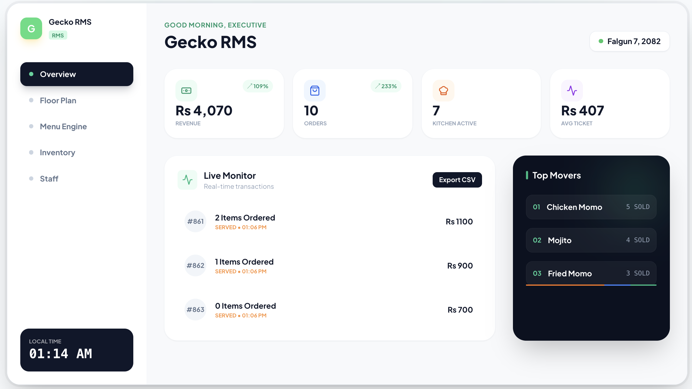
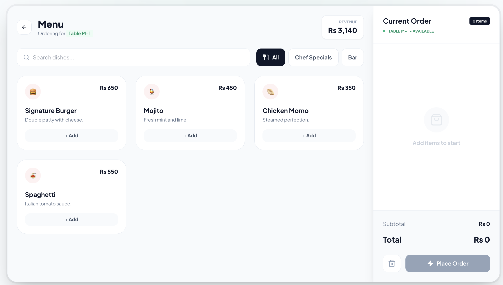
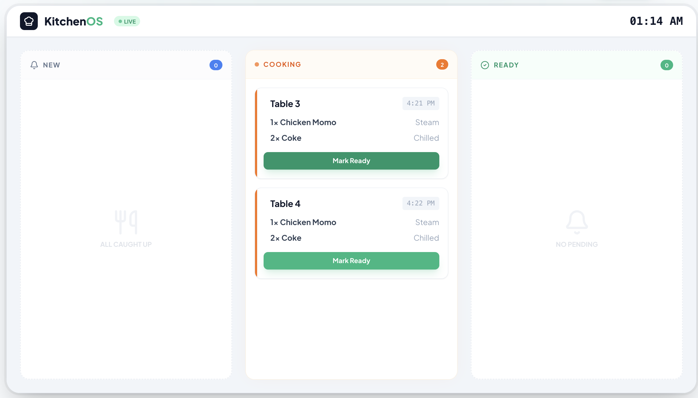
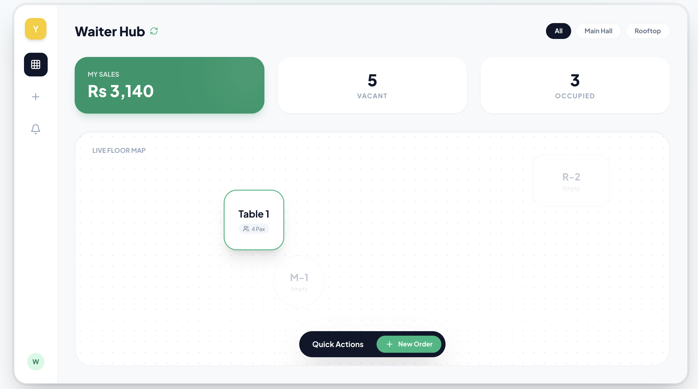
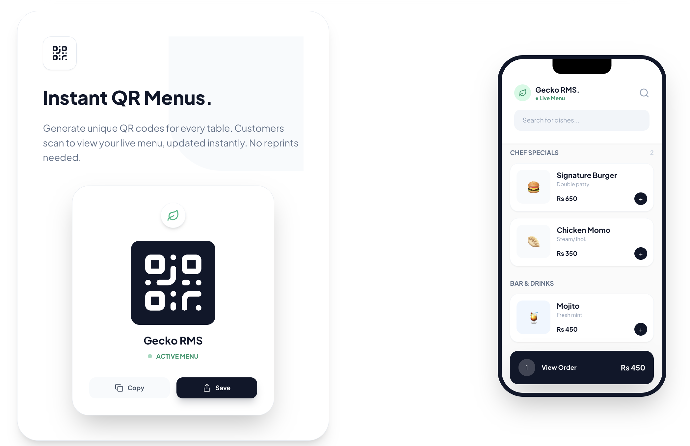

<div align="center">
  <h1>🦎 Gecko RMS</h1>
  <p><b>The Next-Generation Restaurant Management OS</b></p>
  <p>Speed is a superpower. Streamline your entire restaurant operation from table-side KOT to executive analytics with our 120fps hardware-accelerated web app.</p>

  <p>
    <a href="https://rms.geckoworksnepal.com.np/"></a>
  </p>

  <p>
    
    
    
    
    
  </p>
</div>

---

## 📑 Table of Contents
- [About The Project](#-about-the-project)
- [The Quad-OS Ecosystem](#-the-quad-os-ecosystem)
- [Key Features](#-key-features)
- [System Architecture](#️-system-architecture)
- [Getting Started](#-getting-started)
- [Deployment](#-deployment)

---

## 📖 About The Project

Managing a high-volume restaurant requires a system that refuses to lag. **Gecko RMS** is a comprehensive, real-time operating system built to handle the chaos of the hospitality industry in Nepal. 

**One OS. Every Role.** What the waiter enters, the kitchen sees instantly, and the owner tracks globally. 

---

## 🔥 The Quad-OS Ecosystem

### 👑 1. Executive Admin Dashboard
*Your real-time financial command center. Track daily revenue, live transactions, table occupancy, and top-moving items like "Chicken Momo" and "Mojito" with zero lag.*
<br>


<br>

### ⚡ 2. POS & Menu Engine
*Lightning-fast, intuitive checkout. Easily search dishes, filter by "Chef Specials" or "Bar", manage table billing, and process orders instantly.*
<br>


<br>

### 🧑‍🍳 3. Kitchen Display System (KitchenOS)
*Paperless Kitchen Order Tickets (KOT). Instantly receive new orders, move items to the "Cooking" queue, and mark plates as "Ready" to ping the waitstaff.*
<br>


<br>

### 🏃‍♂️ 4. Waiter Hub & Interactive Floor Plan
*Fully responsive table-side management. Waitstaff can view their total sales, check vacant/occupied tables, and drag-and-drop tables on the Live Floor Map.*
<br>


<br>

### 📱 5. Instant QR Menus & Mobile Ordering
*Generate unique QR codes for every table. Customers scan to view your live mobile menu, updated instantly without reprints.*
<br>


---

## ✨ Key Features

* ⚡ **Instant Sync Engine:** Changes propagate across all devices (Admin, POS, Kitchen) in under 200ms. No refreshing required.
* 📶 **Offline Mode:** Internet down? No problem. Gecko keeps working locally and syncs payloads when back online.
* 🛑 **Disabled Menus Protection:** Real-time inventory alerts prevent staff from ordering items that just went out of stock.
* 🎨 **120fps UI Physics:** Built with Framer Motion for ultra-smooth, native-app-like interactions (Magnetic buttons, drag-to-pan floor maps).
* 🖨️ **Smart Billing:** Auto-calculate taxes, apply dynamic discounts, and generate thermal-printer-ready receipts.

---

## 🏗️ System Architecture

Gecko RMS relies on a modern, highly scalable tech stack:

* **Frontend:** Next.js (App Router), React 19, Tailwind CSS, Lucide Icons.
* **Animation:** Framer Motion (Hardware-accelerated transforms).
* **Backend & Auth:** Node.js, Next.js Server Actions, Supabase (PostgreSQL).
* **Infrastructure:** Self-Hosted Ubuntu VPS, CloudPanel, Nginx Reverse Proxy.

---

## 🚀 Getting Started

To get a local development environment up and running, follow these steps.

### Prerequisites
* Node.js (v20.x or higher recommended)
* Git

### Installation

1. **Clone the repository:**
   ```bash
   git clone [https://github.com/Nischal456/gecko-rms.git](https://github.com/Nischal456/gecko-rms.git)